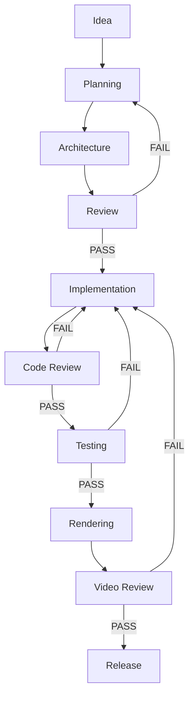
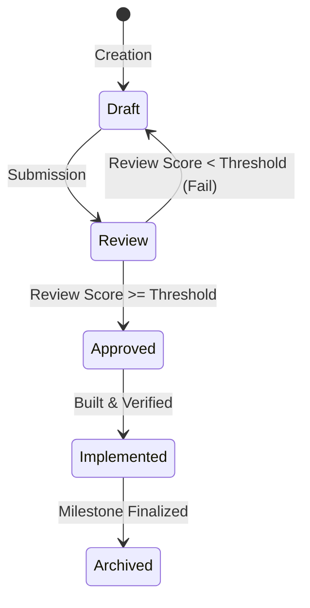
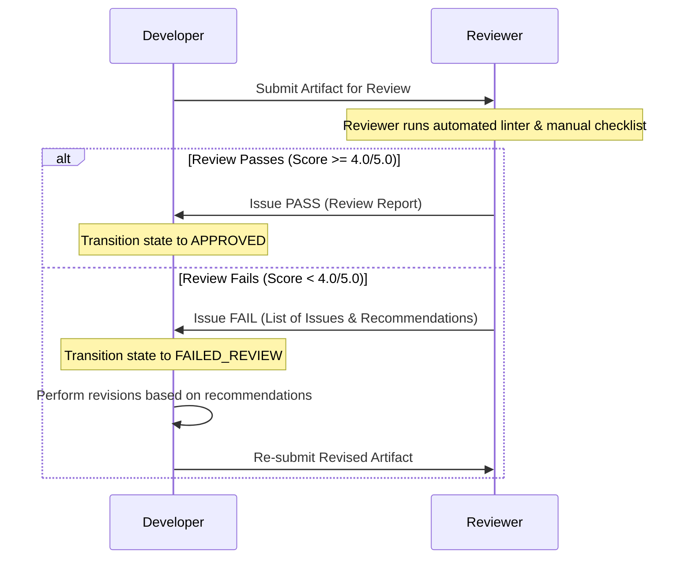
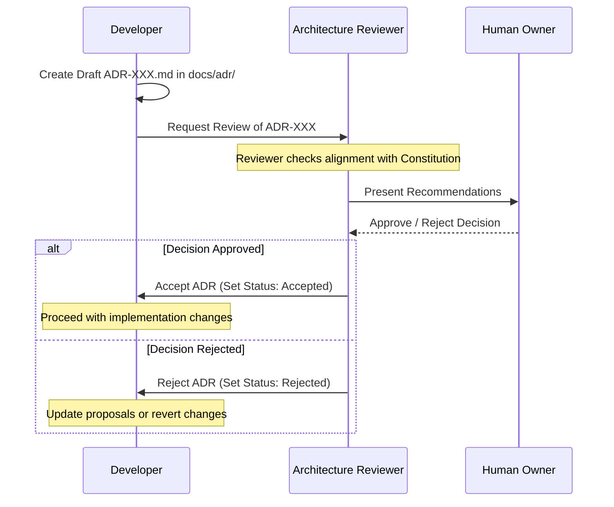

# Zenn Educational Animation Engine (ZEAE)
## Development Operating System (ZEAE-OS) v1.0

---

## 1. Purpose of the Operating System

The Zenn Educational Animation Engine Development Operating System (ZEAE-OS) defines the operational, administrative, and quality control rules governing the development of the Zenn Educational Animation Engine (ZEAE). 

ZEAE-OS serves as a governance framework for a multi-agent AI system and cooperating human engineers. Its objectives are to:
1. **Ensure Deterministic Quality**: Transition the production of educational animation from ad-hoc coding to a predictable, review-gated assembly line.
2. **Prevent Architecture Drift**: Enforce boundaries between components, preventing premature optimization, visual decoration without intent, or structural regressions.
3. **Formalize AI Agent Collaboration**: Define explicit boundaries, rights, authorities, and limitations for each agent type in the development ecosystem.
4. **Identify & Institutionalize Knowledge**: Establish a continuously updated repository of visual language and technical design rules, ensuring the engine "learns" from reviews.

This document is a **governance specification**. It details workflows, gates, reporting formats, folder layouts, and naming rules. It contains no engine or rendering source code. All agents operating within this workspace are legally bound to enforce and comply with this document.

---

## 2. Project Lifecycle

The ZEAE project lifecycle is a sequential, gated progression path. A project refers to any end-to-end production of an educational animation or the development of a core engine component.



### Lifecycle Stage Descriptions

1. **Idea**: Conceptual stage where educational topics and reference inspirations are identified.
2. **Planning**: Definition of the technical roadmap or the visual storytelling intent. High-level storyboards or feature lists are drafted.
3. **Architecture**: Drafting of design documents, component APIs, data schemas, or visual blueprints. No functional code is written.
4. **Review**: Verification of plans and designs against the Constitution, existing architectures, and performance/clarity guidelines.
5. **Implementation**: Coding of features, creation of digital assets, or layout of scenes based on approved designs.
6. **Code Review**: Static analysis, syntax verification, structural inspection, and conformance checks on implementation changes.
7. **Testing**: Automated build runs, integration testing, unit verification, and rendering checks.
8. **Rendering**: Compiling scene blueprints, assets, and code into raw video/audio frames via the deterministic renderer.
9. **Video Review**: Qualitative and quantitative assessment of rendered frames against visual language principles and audio synchronization rules.
10. **Release**: Compilation of output files, metadata tagging, documentation updates, and archiving of reference patterns.

---

## 3. Project State Machine

To enforce the lifecycle, every active project or subsystem must have an explicit state recorded in the project dashboard (`project_state.json`). 

### State Definition Matrix

| State | Purpose | Allowed Actions | Entry Conditions | Exit Conditions |
| :--- | :--- | :--- | :--- | :--- |
| **NOT_STARTED** | Initial default state of a scheduled workspace task. | Allocation of resources; assignment of agents. | Task created or scheduled. | Plan template initialized. |
| **PLANNING** | Active scoping and goal definition phase. | Research; script drafting; high-level sketching; resource mapping. | Transition requested from NOT_STARTED. | Implementation plan drafted and signed off by Developer. |
| **ARCHITECTURE** | Mapping technical and visual specifications. | Schema drafting; UML creation; flowchart drawing; interface planning. | PLANNING phase completed. | Architectural specifications drafted and signed off by Architect. |
| **IMPLEMENTATION** | Active writing of code or compiling visual scenes. | Coding; scene construction; asset editing; local execution. | ARCHITECTURE specifications approved. | Code compiled without errors; tests pass locally. |
| **REVIEW** | Formal inspection of code and design by reviewers. | Lint checks; architectural checks; peer review runs. | Implementation declared "Complete" by Developer. | Master Review PASS score attained (No blocking issues open). |
| **FAILED_REVIEW** | Holding state for failed reviews to block progression. | Debugging; code modification; plan revision. | Review score falls below threshold or a blocker is raised. | Revised artifact submitted for re-review. |
| **READY_FOR_TESTING** | Active validation testing state. | Automated test suite execution; integration checks; regression tests. | Review phase passed successfully. | Test logs show 100% success rate. |
| **READY_FOR_RENDER** | Compilation state for final video assembly. | Renderer invocation; cache clearing; asset loading. | Testing verified clean. | Frame generation process finishes without crashes. |
| **RENDERED** | Video output files successfully generated. | Metadata mapping; quality report generation. | Output file exists and matches size/checksum rules. | Video review pipeline initiated. |
| **VIDEO_REVIEW** | Qualitative review of timing, animation, and captions. | Frame analysis; visual checking; audio sync checking. | RENDERED state verified. | Reviewer reports PASS score. |
| **DONE** | Final completion state. | Archiving of artifacts; registry updates. | VIDEO_REVIEW passed; Release Manager approval signed. | None. State is terminal. |

---

## 4. Reference Analysis Lifecycle

Reference videos are the core learning assets of the project. They do not enter production directly; they are ingested, studied, and cataloged.

```mermaid
flowchart LR
    RefVideo[Reference Video] --> Ext[Metadata Extraction]
    Ext --> Scene[Scene Detection]
    Scene --> Align[Transcript Alignment]
    Align --> VLE[Visual Language Extraction]
    VLE --> PatRev[Pattern Review]
    PatRev --> BlueGen[Blueprint Generation]
    BlueGen --> Appr[Approval]
    Appr --> Avail[Available for Production]
```



### Ingestion Pipeline Stages

1. **Reference Video Input**: Ingesting raw visual assets (e.g., MP4/MKV) into the corpus.
2. **Metadata Extraction**: Analyzing resolution, frame rate, color space, audio tracks, and container specs.
3. **Scene Detection**: Chunking the video into discrete scenes based on hard cuts, fades, and visual transitions.
4. **Transcript Alignment**: Aligning audio transcripts with timestamped scene changes.
5. **Visual Language Extraction**: Mapping design decisions such as camera framing (wide, close-up), motion velocity (linear, ease-in), color palettes (hex values), and composition layouts (rule of thirds, centering).
6. **Pattern Review**: Reviewing the extracted design patterns to confirm they comply with the ZEAE Visual Constitution (e.g., they present a clear communication principle, not a cosmetic decoration).
7. **Blueprint Generation**: Transforming findings into reusable, abstract scene blueprints.
8. **Approval**: Reviewer sign-off validating that the blueprint is correct and contains no copyright infringements or clone artifacts.
9. **Available for Production**: Moving the approved blueprint to the active database.

---

## 5. Reference Corpus Management

The reference library is a strict, version-controlled repository.

### Corpus Structure
Every reference asset must be contained in its own folder under `reference/` matching the pattern `video[0-9]{3}/`.

```
reference/
  video001/
    original.mp4
    transcript.txt
    metadata.json
    scene_analysis.json
    camera_analysis.json
    composition_analysis.json
    reviewer_report.md
```

### Accompanying Files Specification
1. `original.mp4`: The source reference video file.
2. `transcript.txt`: Human/machine-verified transcription with millisecond-precision timestamps.
3. `metadata.json`: Stores video parameters (dimensions, frame rate, duration, source link).
4. `scene_analysis.json`: Records timestamps, transitions, visual categories, and primary messaging of each scene.
5. `camera_analysis.json`: Records camera paths, zooming ratios, panning vectors, and visual motivations.
6. `composition_analysis.json`: Outlines layouts, primary subjects, text positioning, and background designs.
7. `reviewer_report.md`: Reviewer evaluation validating the educational value of the reference patterns.

### Governance Rules
- **Admission**: New references require a written proposal proving that the reference video teaches a pattern not currently covered in the database.
- **Versioning**: Any modification to a reference analysis file must increment the minor version (e.g., `1.0` to `1.1`). Structural alterations to schemas increment the major version.
- **Artifact Linking**: Output storyboards must explicitly link back to the reference folder and file block (e.g., `reference/video001/scene_analysis.json#L45-L60`) to prove visual intent origin.
- **Deprecation**: References identified as visual clones, low educational quality, or copyright risks must be marked `DEPRECATED` in their `metadata.json` and deleted from the active engine registry.

---

## 6. Artifact Lifecycles

An artifact is any file produced during development. Every artifact must pass through a strict state progression to ensure authority.

### Target Artifact Types
- **Implementation Plan**: `docs/plans/`
- **Storyboard**: `storyboards/`
- **Visual Blueprint**: `storyboards/blueprints/`
- **Video Output**: `output/`
- **Reports**: `reports/`
- **Assets**: `assets/`
- **Specification**: `docs/`



### Transition Gates and Authorities
1. **Draft ➔ Review**: The creator agent marks the status as `Under Review`.
2. **Review ➔ Approved**: The assigned Reviewer Agent executes the checklist, logs a score, signs off, and transitions the status.
3. **Review ➔ Draft**: The Reviewer rejects the file, detailing the issue list.
4. **Approved ➔ Implemented**: The Developer writes the code/layout satisfying the artifact.
5. **Implemented ➔ Archived**: The Release Manager locks the version to prevent modification.

---

## 7. Knowledge Base Architecture

The Knowledge Base is the central repository where the engine accumulates its learned rules over time.

### Directory Structure
```
knowledge_base/
  visual_language/
    composition_rules.md
    color_harmonies.md
  camera_language/
    movement_rules.md
    focus_guidelines.md
  animation/
    velocity_curves.md
    attention_direction.md
  reviewer_rules/
    qa_checklists.md
  lessons_learned/
    production_failures.md
```

### Updating Governance
- **Reviewer Contribution**: Whenever an agent rejects a design in a review pipeline, it MUST document the reason. If the reason represents a reusable design pattern or constraint, the reviewer must append this rule to the corresponding category file in the Knowledge Base.
- **Querying**: Before generating any storyboard, plan, or script, the Planner or Developer agent must query the Knowledge Base to retrieve active rules and prevent previously documented mistakes.

---

## 8. Development Phases & Milestone Gates

```
Phase 0 ➔ Phase 1 ➔ Phase 2 ➔ Phase 3 ➔ Phase 4 ➔ Phase 5 ➔ Phase 6 ➔ Phase 7 ➔ Phase 8
```

---

### Phase 0: Operating System
- **Goal**: Establish the project governance framework.
- **Inputs**: constitution.md, AGENTS.md.
- **Outputs**: docs/01_operating_system.md.
- **Deliverables**: Complete governance document defining all workflows.
- **Exit Criteria**: Document exists, contains all 22 required sections, and passes the manual self-review.
- **Quality Gate**: **QG-0 (Governance Verification)**: Signed off by Human Owner.

---

### Phase 1: Master Review Framework
- **Goal**: Implement the quantitative scoring and review execution rules for all agents.
- **Inputs**: docs/01_operating_system.md.
- **Outputs**: docs/02_master_review_framework.md, automated lint configurations.
- **Deliverables**: Verification rules, score calculations, severity thresholds, reporting schemas.
- **Exit Criteria**: Master Review Framework document complete.
- **Quality Gate**: **QG-1 (Review Engine Verification)**: Architecture Reviewer sign-off.

---

### Phase 2: Knowledge Base
- **Goal**: Initialize the rules engine directories and baseline composition rules.
- **Inputs**: constitution.md, reference/templates/trascript.txt.
- **Outputs**: knowledge_base/ structure and initial markdown rule sets.
- **Deliverables**: Knowledge base files containing baseline visual and camera rules.
- **Exit Criteria**: All standard categories established; rules checked for consistency.
- **Quality Gate**: **QG-2 (Knowledge base structure check)**: Planner sign-off.

---

### Phase 3: Reference Analysis Specification
- **Goal**: Design the specifications for reference video analysis tools.
- **Inputs**: reference/templates/What Did Ancient Humans Do at Night _1080p.mp4.
- **Outputs**: docs/03_reference_analysis_specification.md, JSON schemas for metadata/camera.
- **Deliverables**: Concrete specifications for the metadata extraction and scene chunking engines.
- **Exit Criteria**: Schemas approved and matching corpus structure rules.
- **Quality Gate**: **QG-3 (Schema validation check)**: Architecture Reviewer sign-off.

---

### Phase 4: Visual Language Specification
- **Goal**: Extract visual, animation, and camera design rules from the reference materials.
- **Inputs**: Reference analysis logs, knowledge base.
- **Outputs**: docs/04_visual_language_specification.md.
- **Deliverables**: Visual rules library explaining pacing, composition, framing, and captioning.
- **Exit Criteria**: Every visual pattern maps directly to an educational concept.
- **Quality Gate**: **QG-4 (Visual validation)**: Visual Reviewer sign-off.

---

### Phase 5: Storyboard Blueprint Specification
- **Goal**: Establish the representation framework for scene scripts and storyboard layouts.
- **Inputs**: docs/04_visual_language_specification.md.
- **Outputs**: docs/05_storyboard_blueprint_specification.md.
- **Deliverables**: Blueprint markdown and metadata schema specification.
- **Exit Criteria**: Blueprint schema contains explicit tags for educational idea, composition, and animation.
- **Quality Gate**: **QG-5 (Storyboard format verify)**: Storyboard Reviewer sign-off.

---

### Phase 6: Engine Architecture
- **Goal**: Define the modular architecture of the rendering engine.
- **Inputs**: docs/05_storyboard_blueprint_specification.md.
- **Outputs**: docs/06_engine_architecture.md.
- **Deliverables**: Component mapping, API interfaces, rendering pipeline layouts.
- **Exit Criteria**: Full module diagram completed with strict typed inputs/outputs.
- **Quality Gate**: **QG-6 (Interface design approval)**: Architecture Reviewer sign-off.

---

### Phase 7: Motion Canvas Renderer
- **Goal**: Implement the deterministic Motion Canvas video renderer.
- **Inputs**: docs/06_engine_architecture.md.
- **Outputs**: code/src/renderer/, rendering scripts.
- **Deliverables**: Functional renderer that builds storyboards into MP4s.
- **Exit Criteria**: Successful build; 100% deterministic test video generation.
- **Quality Gate**: **QG-7 (Compilation and verification check)**: Code Reviewer & QA Tester sign-off.

---

### Phase 8: Production Pipeline
- **Goal**: Generate twenty original educational videos.
- **Inputs**: reference/ templates, rendering code, visual specifications.
- **Outputs**: output/videos/*.mp4.
- **Deliverables**: 20 fully rendered, high-quality, education-compliant videos.
- **Exit Criteria**: All 20 videos pass the Video QA check with no errors.
- **Quality Gate**: **QG-8 (Final Production Review)**: Video QA Reviewer & Release Manager sign-off.

---

## 9. Phase Locking Rules

To maintain strict structural integrity, development cannot skip forward.

1. **Strict Dependency Order**: Work on a phase is blocked until all previous phases are in the **DONE** state.
2. **Quality Gate Blockers**: A phase cannot exit if its corresponding Quality Gate (QG-X) has any open BLOCKING issues.
3. **No Code Without Specs**: No programming code or assets may be added to `code/` until Phase 6 (Engine Architecture) has reached the **DONE** state.
4. **Bypass Prohibition**: Under no circumstances may an agent bypass a Quality Gate. Any attempts to merge code or progress plans without reviewer approval trigger an immediate system lock.

---

## 10. Agent Roles & Responsibilities

ZEAE-OS operates through a highly structured RACI system with specialized AI agents.

---

### Planner
- **Mission**: Formulate scripts, high-level objectives, storyboards, and initial layout steps.
- **Inputs**: Reference transcripts, user requests, knowledge base.
- **Outputs**: Draft plans, storyboard scripts.
- **Authority**: Propose plans and storyboards.
- **Limitations**: Cannot approve plans, write code, or execute rendering.
- **Success Criteria**: Plans explain educational concepts clearly and use precise visual intent terminology.

---

### Architecture Reviewer
- **Mission**: Verify that designs, schemas, APIs, and folder paths comply with engine standards.
- **Inputs**: Architecture specifications, ADRs.
- **Outputs**: Architecture review reports, design approvals.
- **Authority**: Approve/reject architecture documents; veto code structure changes.
- **Limitations**: Cannot write implementation code.
- **Success Criteria**: Zero architectural duplication; 100% decoupling of modules.

---

### Code Reviewer
- **Mission**: Enforce clean code, strong typing, proper comments, and safety rules.
- **Inputs**: Source code files, code diffs.
- **Outputs**: Code review reports.
- **Authority**: Approve/reject code merges.
- **Limitations**: Cannot modify architecture documents; cannot write functional code.
- **Success Criteria**: Zero lint errors; type safety compliance; no unused code block elements.

---

### Storyboard Reviewer
- **Mission**: Validate that storyboards convey ideas logically before rendering begins.
- **Inputs**: Storyboard blueprints, knowledge base rules.
- **Outputs**: Storyboard reports.
- **Authority**: Approve/reject scene blueprints for production.
- **Limitations**: Cannot render video; cannot change scripts directly.
- **Success Criteria**: Clear composition mapping for every frame; alignment with educational themes.

---

### Visual Reviewer
- **Mission**: Inspect graphic design, contrast, text layout, and composition quality.
- **Inputs**: Static image outputs, visual assets, styling templates.
- **Outputs**: Visual quality reports.
- **Authority**: Reject assets that violate color balance or layout rules.
- **Limitations**: Cannot edit source code.
- **Success Criteria**: Layout conforms to the rule of thirds or designated composition styles.

---

### Video QA Reviewer
- **Mission**: Evaluate the final rendered output.
- **Inputs**: Generated MP4 files, original transcript, audio assets.
- **Outputs**: Video QA reports.
- **Authority**: Approve final release candidates.
- **Limitations**: Cannot write renderer code.
- **Success Criteria**: Zero jitter; perfect audio/video synchronization; subtitle text matches narration word-for-word.

---

### Developer
- **Mission**: Build rendering components and implement layouts.
- **Inputs**: Approved architecture plans, blueprints, storyboards.
- **Outputs**: Source code, raw styling, scene assets.
- **Authority**: Write code, run local builds.
- **Limitations**: Cannot approve own code; cannot modify core architecture without an approved ADR.
- **Success Criteria**: Implementation matches blueprints.

---

### QA Tester
- **Mission**: Validate system behaviors using automated tests.
- **Inputs**: Source code, test scripts.
- **Outputs**: Test reports, regression logs.
- **Authority**: Block release builds if tests fail.
- **Limitations**: Cannot write feature code.
- **Success Criteria**: 100% code path coverage on rendering functions.

---

### Release Manager
- **Mission**: Oversee final tagging, metadata documentation, and versioning.
- **Inputs**: Verified videos, QA reports, build artifacts.
- **Outputs**: Release manifests, version tags.
- **Authority**: Lock code releases; finalize archives.
- **Limitations**: Cannot modify code or design specifications.
- **Success Criteria**: Zero metadata naming mismatch; clean build deployment.

---

## 11. Decision Authority & RACI Matrix

The RACI (Responsible, Accountable, Consulted, Informed) matrix defines boundaries of control.

| Domain | Planner | Developer | Architecture Reviewer | Code Reviewer | Storyboard Reviewer | Video QA Reviewer | Release Manager | Human Owner |
| :--- | :---: | :---: | :---: | :---: | :---: | :---: | :---: | :---: |
| **Engine Architecture** | I | R | A | C | - | - | - | A |
| **Folder Structure** | I | - | A | C | - | - | R | A |
| **API Changes** | I | R | A | C | - | - | - | A |
| **Rendering Rules** | - | R | A | C | - | - | - | A |
| **Visual Language** | R | I | C | - | A | - | - | A |
| **Review Approval** | C | - | R | R | R | R | - | A |

- **R (Responsible)**: The agent tasked with creating the design or implementation.
- **A (Accountable)**: The agent with final approval authority, who holds ultimate veto power.
- **C (Consulted)**: The agent providing input or validation.
- **I (Informed)**: The agent notified of changes.

---

## 12. Architecture Decision Record (ADR) Log

Every structural design decision must be recorded in an Architecture Decision Record (ADR) file. ADR files are stored in `docs/adr/` and named `ADR-[0-9]{3}.md`.

### ADR Template Schema

```markdown
# ADR-XXX: [Descriptive Title]

## Status
[Draft | Proposed | Accepted | Rejected | Superseded by ADR-YYY]

## Context
[Describe the problem, constraints, and environmental factors driving this decision.]

## Decision
[State the exact technical choice and architecture impact.]

## Reason
[Provide the logical explanation, benefits, and how this decision aligns with the Project Constitution.]

## Alternatives Considered
- **[Alternative A]**: [Why it was rejected]
- **[Alternative B]**: [Why it was rejected]

## Consequences
- **Positive**: [Expected benefits]
- **Negative**: [Risks, downstream complexities, and mitigation steps]

## Outcome
[Accepted | Rejected - signed off by Architecture Reviewer]
```

---

## 13. Quality Gate System

Each phase transition must pass a dedicated Quality Gate.

| Gate ID | Gate Name | Target Phase | Gate Conditions | Required Evidence | PASS/FAIL/Block Rules |
| :--- | :--- | :--- | :--- | :--- | :--- |
| **QG-0** | OS Check | Phase 0 ➔ 1 | Complete governance mapping. | docs/01_operating_system.md exists. | **FAIL** if any section is empty. **Block** progression. |
| **QG-1** | Review Framework | Phase 1 ➔ 2 | Reviewer checks defined. | docs/02_master_review_framework.md exists. | **FAIL** if scoring metrics are subjective. |
| **QG-2** | Knowledge Base | Phase 2 ➔ 3 | Knowledge base folder structure matches specs. | Active rules files exist. | **FAIL** if category folders are missing. |
| **QG-3** | Analysis Specs | Phase 3 ➔ 4 | Analysis schemas defined. | JSON schema files exist. | **FAIL** if camera motion types are undocumented. |
| **QG-4** | Vis-Lang Specs | Phase 4 ➔ 5 | Composition rules match analysis data. | docs/04_visual_language_specification.md. | **FAIL** if style rules lack visual intent notes. |
| **QG-5** | Storyboard Specs | Phase 5 ➔ 6 | Script format structured. | docs/05_storyboard_blueprint_specification.md. | **FAIL** if scene metadata lacks timing rules. |
| **QG-6** | Arch Design | Phase 6 ➔ 7 | Decoupled renderer components. | docs/06_engine_architecture.md. | **FAIL** if interface parameters are untyped. |
| **QG-7** | Engine Ready | Phase 7 ➔ 8 | Clean compile; tests run. | Test suite execution logs. | **FAIL** if code coverage is below 90%. |
| **QG-8** | Release Verification | Phase 8 ➔ DONE | All videos verified. | Video QA checklists; MP4 assets. | **FAIL** if subtitles mismatch by > 0 words. |

---

## 14. Review Pipeline & Feedback Loop

Every artifact must travel through a cyclical verification pipeline to reach approval.



### Review Rules
1. **No Self-Approval**: Developer agents can never review or sign off on their own code or blueprints.
2. **Checklist Conformance**: Every review report must explicitly evaluate all points on the target checklist.
3. **Quantitative Scoring**: Reviews score items on a scale of `1.0` to `5.0`. A minimum score of `4.0` with **zero blocking issues** is required to pass.
4. **Blocking vs. Non-Blocking**:
   - **Blocking**: Structural errors, type safety violations, constitutional breaches.
   - **Non-Blocking**: Stylistic suggestions, minor comments.

---

## 15. Stop Conditions & Guardrails

Agents must stop working and request human intervention under the following conditions:

1. **Constitution Modification Proposed**: Any request or task that requires altering, bypassing, or violating rules in `constitution.md` or `AGENTS.md`.
2. **Unresolved Blocker Loop**: An artifact fails review three times consecutively for the same issue.
3. **Score Below Threshold**: Any review score falls below `2.5` twice consecutively.
4. **Structural Architecture Conflict**: A conflict where implementing one component requires breaking an interface defined in `docs/06_engine_architecture.md`.
5. **Reference Analysis Incomplete**: A request to produce a video without an approved, corresponding visual blueprint in the reference directory.

*When a Stop Condition is met, the active agent must write a diagnostic log detailing the trigger, pause execution, and set `project_state.json` status to `FAILED_REVIEW` or `BLOCKED`.*

---

## 16. Reporting Standards

Every review report generated must use the following identical Markdown format to ensure readability.

```markdown
# [Report Type] Report: [Artifact Name]

## Metadata
- **Date**: [YYYY-MM-DD]
- **Target Artifact**: [Filename with markdown file scheme link]
- **Author Agent**: [Reviewer Agent Name]
- **Developer Agent**: [Developer Agent Name]
- **State**: [PASS | FAIL]
- **Cumulative Score**: [X.X / 5.0]

## Evaluation Checklist
- [ ] **Checklist Item 1**: [PASS | FAIL | N/A] - [Evidence/Notes]
- [ ] **Checklist Item 2**: [PASS | FAIL | N/A] - [Evidence/Notes]

## Issues Found
### Blocking Issues
1. **[Issue ID - e.g., BLK-001]**: [Short Description]
   - **File**: [Link to file and line range]
   - **Violation**: [Why it violates rules]
   - **Required Correction**: [Exact steps to resolve]

### Non-Blocking Issues
1. **[Issue ID - e.g., WRN-001]**: [Short Description]
   - **File**: [Link]
   - **Recommendation**: [Suggested correction]

## Recommendations & Feedback
[Provide a narrative summary of suggestions for the developer agent to improve the codebase or specification.]

## Sign-off
- **Approved By**: [Reviewer Agent Name Signature]
```

---

## 17. Project Folder Standards

The following directories represent the official workspace structure. No files may reside outside this structure.

```
zenn/
  .agents/             # System customization rules (AGENTS.md)
  docs/                # Project design specifications & operating systems
    adr/               # Architecture Decision Records (ADR-XXX.md)
  reviews/             # Review logs for plans, code, and storyboards
  storyboards/         # Markdown storyboards and scene layout specs
    blueprints/        # Abstract design templates extracted from references
  reference/           # Curated library of learning materials
    video001/          # Structure for video 001 files
  assets/              # Reusable vector art, images, and visual components
  code/                # The rendering engine source directory
    src/               # Code implementation files
    tests/             # Automated test scripts
  generated/           # Intermediary render files (images, audio chunks)
  output/              # Final rendered MP4 files ready for release
  logs/                # Run execution and error logs
  reports/             # Review compilation and dashboard reports
```

---

## 18. Naming Standards

To prevent duplication and ensure search predictability, the following naming standards are enforced:

### File and Directory Casing
- **Directories**: Always lowercase with snake_case (e.g., `reference/video_analysis/`).
- **Markdown Files**: Lowercase with snake_case, prefixed by a sequence number when in directories requiring ordered reading (e.g., `docs/01_operating_system.md`).
- **Source Code (TS/JS)**: CamelCase for classes (`CanvasRenderer.ts`), camelCase for utility files (`mathUtils.ts`).
- **JSON Schemas**: lowercase with snake_case ending in `.schema.json`.

### Component Naming Conventions
- **Interfaces**: Must start with a capital `I` (e.g., `IRenderer`).
- **Classes**: Nouns describing exact function (e.g., `SceneComposer`).
- **Assets**: `[category]_[concept]_[variant].[extension]` (e.g., `bg_isolation_dark.svg`).
- **Videos**: `zeae_[concept]_[phase_number].mp4` (e.g., `zeae_sleep_cycles_08.mp4`).

---

## 19. Change Management Flow

When a developer agent needs to change an API, database schema, or folder structure, it must execute the following protocol:



---

## 20. Definition of Done (DoD)

A task is not considered complete until it meets its respective Definition of Done checklist.

### Documents & Specifications
- [ ] Contains zero placeholders or TODO annotations.
- [ ] All file names and folder links are formatted with the markdown scheme scheme.
- [ ] Quality Gate conditions are explicitly defined.
- [ ] Formatted using standard markdown tables and lists.

### Implementation Plans
- [ ] Outlines exact files to be modified/created.
- [ ] Outlines the exact automated test commands.
- [ ] Reviewer has signed off with a score >= 4.0.

### Code
- [ ] Compiles successfully with zero warnings or errors.
- [ ] Strong typing implemented throughout.
- [ ] Unit test coverage >= 90%.
- [ ] Lint check reports zero warnings.

### Storyboards & Blueprints
- [ ] Frame sequence mapping includes timing in seconds.
- [ ] Composition layout described for every scene change.
- [ ] Links back to the source reference video block.

### Rendered Videos
- [ ] Resolution matches `1920x1080` (or `1080x1920` for shorts).
- [ ] Frame rate is deterministically constant (e.g., 60fps).
- [ ] Visual assets do not overlay or clash with subtitles.
- [ ] Synchronized audio track containing zero clipping.

---

## 21. Project Dashboard Schema

The workspace dashboard is recorded in `project_state.json` at the root.

```json
{
  "$schema": "http://json-schema.org/draft-07/schema#",
  "title": "ProjectState",
  "type": "object",
  "properties": {
    "projectName": { "type": "string" },
    "currentPhase": { "type": "integer" },
    "projectState": { "type": "string" },
    "lastReleaseVersion": { "type": "string" },
    "qualityGatesPassed": {
      "type": "array",
      "items": { "type": "string" }
    },
    "blockingIssuesCount": { "type": "integer" },
    "activeAdrs": {
      "type": "array",
      "items": { "type": "string" }
    },
    "verificationMetrics": {
      "type": "object",
      "properties": {
        "codeCoverage": { "type": "number" },
        "lintErrors": { "type": "integer" },
        "testFailures": { "type": "integer" }
      },
      "required": ["codeCoverage", "lintErrors", "testFailures"]
    }
  },
  "required": [
    "projectName",
    "currentPhase",
    "projectState",
    "lastReleaseVersion",
    "qualityGatesPassed",
    "blockingIssuesCount",
    "activeAdrs",
    "verificationMetrics"
  ]
}
```

---

## 22. Complete Roadmap

The roadmap lists the dependency sequence from Phase 0 to Phase 8.

```
[Phase 0: Governance] ➔ [Phase 1: Review Framework] ➔ [Phase 2: Knowledge Base]
                                                               ⬇
[Phase 5: Storyboard Spec] ➔ [Phase 4: Vis-Lang Spec] ➔ [Phase 3: Ref-Analysis Spec]
       ⬇
[Phase 6: Engine Architecture] ➔ [Phase 7: MC Renderer] ➔ [Phase 8: Production Pipeline]
```

### Roadmap Milestones
- **Milestone 0 (OS Setup)**: Phase 0 exit. System governance established.
- **Milestone 1 (Quality Framework)**: Phase 1 exit. Automated scoring guidelines ready.
- **Milestone 2 (Rules Library)**: Phase 2 exit. Initial rule templates live.
- **Milestone 3 (Analysis Standard)**: Phase 3 exit. File format structure for reference tracking locked.
- **Milestone 4 (Visual Specs)**: Phase 4 exit. Mapping of core concepts to graphical parameters finalized.
- **Milestone 5 (Blueprint Standard)**: Phase 5 exit. Structured storyboard files ready for integration.
- **Milestone 6 (System Architecture)**: Phase 6 exit. Abstract engine classes and interfaces designed.
- **Milestone 7 (Renderer Built)**: Phase 7 exit. Motion Canvas code compiling, producing output frames.
- **Milestone 8 (Production Completed)**: Phase 8 exit. 20 original animation videos released.
