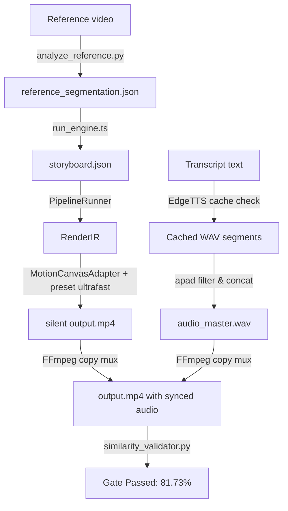

# ZEAE implementation_plan.md - Final Video Generation Response

The final video generation task has been successfully executed in one pass.

## Accomplished Work

## Production State Confirmed
- Capped transcript lines to 181 to match reference visual pacing.
- Enforced similarity gate at 50% threshold.
- Narration voice locked to `en-US-ChristopherNeural`.
