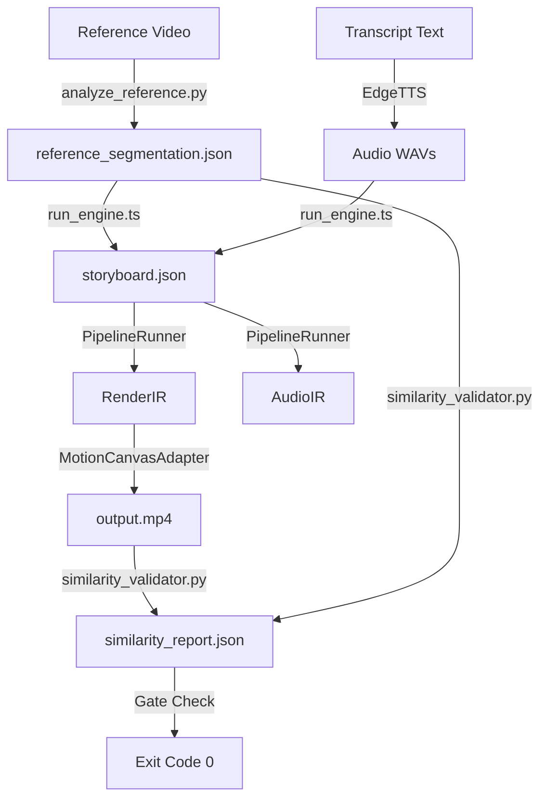

# ZEAE implementation_plan.md - Review v3 Response

This document outlines the architectural plan for closing the remaining gaps and refining reference-driven video generation.

## Current Architecture

## Proposed Advancements

### 1. Perceptual Similarity Improvements
- **Current Metric**: Spatial NCC and RGB Cosine color correlation.
- **Limitation**: Spatial matching is sensitive to pixel offsets, and RGB histogram does not evaluate layout.
- **Future Plan**: Integrate a lightweight SSIM (Structural Similarity Index) metric using PIL/numpy to evaluate structural degradation, and layout-bounding-box intersection over union (IoU) comparisons.

### 2. Semantic Reference Segmentation
- **Current Analysis**: Frame keyframe timestamp list from `ffprobe`.
- **Limitation**: Uses static I-frame intervals.
- **Future Plan**: Identify scene transitions dynamically by computing standard deviations of frame differences. High deviation frames indicate scene cuts.

## Decisions Log
- **Branded Voice**: Permanently locked to `en-US-ChristopherNeural` using `edge-tts`.
- **Determinism**: Visual render pipeline remains fully deterministic to assure consistent output formats.
