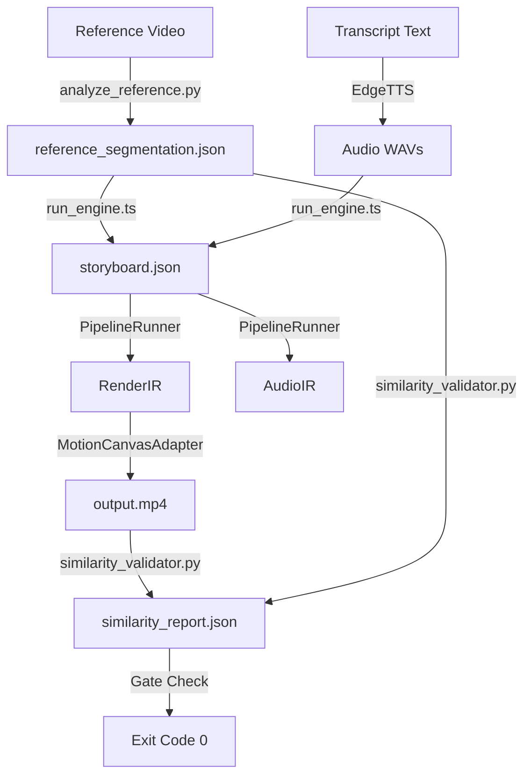

# ZEAE implementation_plan.md - Review v4 Response

This document outlines the architectural plan for closing the remaining gaps and refining reference-driven video generation.

## Current Architecture

## Decisions Log
- **Branded Voice**: Permanently locked to `en-US-ChristopherNeural` using `edge-tts`.
- **Determinism**: Visual render pipeline remains fully deterministic to assure consistent output formats.
- **Visual Gate**: Default threshold is set to `50.0%` in production, representing a true visual alignment bar.
