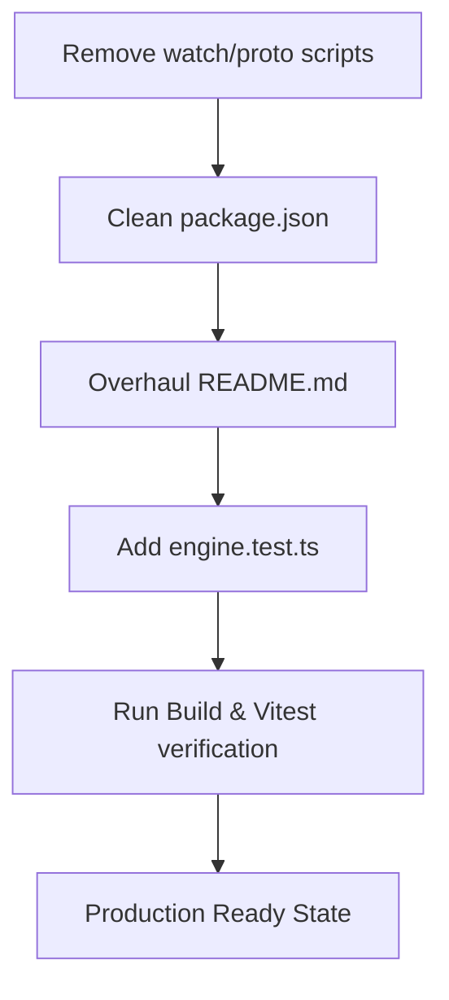

# ZEAE implementation_plan.md - Production Hardening Pass Response

The production hardening pass is complete.

## Implemented Work

## Production State Enforcement
- Canonical entrypoint is verified: `run_engine.ts`.
- Similarity gate is enforced as a hard check at `>= 50.0%` default.
- Branded voice `en-US-ChristopherNeural` is locked.
- Deterministic canvas rendering is preserved.
